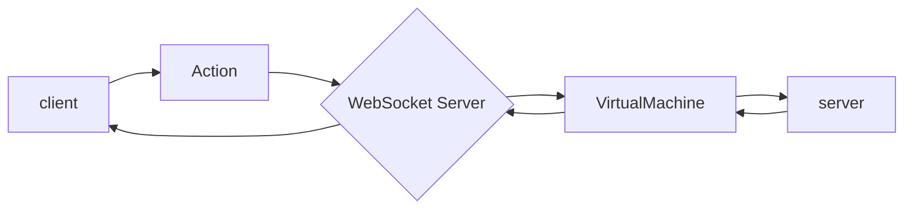

# Development

Overview of the concepts that make games work on the Acos platform.

## Simulator

Development of the client and server can be done offline using the [acosgames](https://github.com/acosgames/acosgames) simulator. This simulates the environment used on [acos.games](https://acos.games).

Your code in `game-client` and `game-server` sit on the edge, while the simulator sits in the middle.

### State Machine



The client peforms an **action** and the server executes that action. Your game logic results are saved into the [Game State](#game-state) which is just a plain JSON object. The simulator will synchronize the JSON between all connected clients and store the game state for the next action.

!!! note "Note"

    It is recommended that your server code be deterministic.  Meaning the same sequence of actions should always return the same result!  If you need to randomize, try to use a seed from any data within the [Game State](#game-state).


---

## Game Client

The client is responsible for displaying the game state that is forwarded to your game's front end. There is a helper file called [acosg.js](https://github.com/acosgames/tictactoe/blob/main/game-client/acosg.js) that listens for incoming state updates. Everytime there is an update, you will receive the full state. The TicTacToe example uses ReactJS, but any JS framework can be used, as long as you can receive updates and send actions by re-creating what the [acosg.js](https://github.com/acosgames/tictactoe/blob/main/game-client/acosg.js) file does.

!!! note "Note"

    [Click here](#example-game-state) to view an example Game State from Tic Tac Toe.


### local object

```js
"local": {
    "name": "joe",
    "rank": 1,
    "score": 100,
    "id": "8CCkf",
    "ready": true,
    "type": "X"
}
```

The platform will automatically add the `local` player object which is identical to the [players](#players) game state for the local player.

### next object

```js
 "next": { "id": "manC6" },
```

The next object shows which player id is allowed to make the next action.  You should avoid sending if the local player is not in the `id` field.

When the `id` is `'*'`, all players are allowed to submit an action.

### time + latency

```js
"timer": {
    "end": 1641441249109,
    "seconds": 10,
    "seq": 5
}
```
[Timers](#timer) are very important to keep games fast-paced.  

In order to ensure that players with high latency (400+ms) can feel the same rush of putting in a move at 0.1 seconds, all clients automatically have the [timer.end](#timer) adjusted based on their latency to match server time.

You can use the `seconds`, which is the original time in seconds set by the server, to calculate a percentage of time left.


### send action

Client's can send actions in the following format using the [acosg.js](https://github.com/acosgames/tictactoe/blob/main/game-client/acosg.js#L134) `send` function:

```js
send("pick", 3);
```

The first parameter is always a string, second parameter can be any primitive, array, or object type.

-----

## Game Server

The server is responsible for building the **game state** that is automatically synchronized to all clients.

There is a helper file used on the game-server side also called [acosg.js](https://github.com/acosgames/tictactoe/blob/main/game-server/acosg.js). Its a wrapper to help simplify using the globals listed below.

See the [index.js](https://github.com/acosgames/tictactoe/blob/main/game-server/index.js) and [game.js](https://github.com/acosgames/tictactoe/blob/main/game-server/game.js) for the usage of the helper file.

Your server code will be run inside a JS virtual machine, and you will have access to the **globals** object.

```js
//log a message, only available in simulator
globals.log(msg);

//log an error, only available in simulator
globals.error(msg);

//get the array of actions sent by users or system
globals.actions();

//get the latest Game State JSON
// copy this to a variable and make changes directly to it
globals.game();

//get the database JSON (optional)
// saved as 'database.json' in the game-server folder.
// This holds your static JSON, which is useful for trivia games
globals.database();

//when finished updating, call this to "commit" the state
globals.finish(gameState);

//kill the game immediately
globals.killGame();

//if you detect a bad action, tell system you want it ignored.
globals.ignore();
```

### Player actions

All player actions will contain metadata generated by the platform, that identify a user and more.  

```json
{
  "room_slug":"MLR9JN",
  "timeleft":12066,
  "seq":1,
  "user":{
    "id": "manC6"
  },
  "type":"pick",
  "payload": {}
}
```

#### **room_slug**

This is the ID of the game room.  It's used mostly by the platform to target the correct room. 

#### **timeleft**

If there is a timer, this will be how much timeleft in milliseconds before timer hits zero.  It's a convenience so you don't have to calculate yourself. 

To convert to seconds divide by `1000`.

#### **seq**

Every time a new timer is set, the sequence is incremented by 1.  This helps ensure actions are only processed for the correct sequences.

#### **user > id**

The user object holds the `id` of the user.  This is a shortid that can be used inside the "[players](/development/#players)" object in the Game State.

#### **type**

The type must always be a string.  This string value is provided by the client that you can process in your server code.

#### **payload**

The payload can be any primitive (int, float, string), array, or object.  It is best to keep these as simple as possible.  Only your server code will look at this value.


### System actions

These actions are triggered automatically by the server

#### **pregame**

Once the first player has joined the game, this action is triggered immediately.  A timer of 20 seconds will be activated, and if it reaches zero, it will call a `noshow` action.
```json
{
  "type": "pregame"
}
```

#### **noshow**

An internal action that notifies the platform the game failed to start because players never joined the room.  The room will be killed immediately.
```json
{
  "type": "noshow"
}
```

#### **starting**

After all players have joined and have sent a `ready` action, the `starting` action will be triggered.  Where a short 5 second timer will start, and when it reaches zero, will trigger the `gamestart` action.
```json
{
  "type": "starting"
}
```

#### **gamestart**

Triggered when the timer from the `starting` action reaches zero.  Any timers that reach zero after this will trigger the `skip` action.
```json
{
  "type": "gamestart"
}
```

#### **skip**

Triggered when a timer reaches zero.  You should handle this action to forfeit a player or do some other logic.
```json
{
  "type": "skip"
}
```

---

## Game State

The Game State consists of several objects:

```json
{
  "state": {},
  "players": {},
  "rules": {},
  "events": {},
  "timer": {},
  "next": {}
}
```

### state

This is where you should keep all data that mutates on every action to modify the game board or environment.

#### hidden values

Inside the `state` object, you can create variables with `_` underscore to make them private.

Example, that hides the deck from sending to clients:

```json
{
  "state": {
    "_deck": ["AS", "AH", "3D"]
  }
}
```

#### gamestatus

The **gamestatus** key is auto-generated by the platform and saved inside the `state`.

The possible values are:

1. `pregame`
2. `starting`
3. `gamestart`
4. `gameover`

Example:

```json
{
  "state": {
    "gamestatus": "gamestart"
  }
}
```

Game status is used internally by the platform with the timer to trigger the next gamestatus. Exception is when `gamestatus="gamestart"`, the timers will cause a "skip" action, for the current player(s) who are next.

### players

When players are added into the game, they are automatically added into the players object. All players have a `shortid` that references them inside the Acos databse.

```json
{
  "players": {
    "ABCDEF": {
      "name": "JoeFacebook",
      "rank": 2,
      "score": 0,
      "ready": true
    },
    "UVWXYZ": {
      "name": "JoeOfTexas",
      "rank": 2,
      "score": 0,
      "ready": true
    }
  }
}
```

#### ready

Your client must trigger an action `send('ready', true)` when your client front-end is loaded. This is saved into the player's object, and let's the platform know when to trigger a **gamestart** event.

#### rank & score

`rank` is set by you to determine who is in 1st, 2nd, 3rd, ..., nth place for the room. On gameover, the system will update the global player ratings based on this value. Lower is better.

`score` is set by you to determine how many points the users have earned. This has no purpose unless rank is removed, where scores will then be used to calculate new player ratings. Higher is better.

#### name

`name` is the user's name that was setup when user first logged in.

#### hidden values

Inside the `players` object, you can create variables with `_` underscore to make them private.

Example that hides the user's cards from sharing with other players:

```json
{
  "player": {
    "ABCDEF": {
      "name": "JoeOfTexas",
      "rank": 1,
      "_cards": ["2S", "3S", "4S", "5S", "6S"]
    }
  }
}
```

### rules

Rules are not mandatory, but its a clean way to define the rules of your game. How many rounds, max players, min players. Ideally, these should be static and not change between actions, but you can if you want.

```json
{
  "rules": {
    "maxplayers": 2,
    "minplayers": 2,
    "rounds": 3
  }
}
```

### events

Events are used to notify of a specific type of state change.

#### system defined events

- `pregame` - when the first player joins the game
- `starting` - when all players are ready (client front-ends are all loaded)
- `gamestart`- after the starting countdown reaches zero

#### required gameover 

You must trigger this event to end the game.  The state with this event will be the final update for all clients.

- `gameover` - notifies everyone the game ended and room will be closed immediately

#### custom events

You can create your own events by defining any key, here we used `pick`:

```json
{
  "events": {
    "pick": {
      "user": "ABCDEF",
      "picked": 3
    }
  }
}
```

Or you could do even simpler:

```json
{
  "events": {
    "pick": 3
  }
}
```

### timer

The timer helps control the flow of the game. It is important that you always set a timer. Rooms will be destroyed if they do not complete within 1 hour.

To set a timer, make sure you commit the game state with this format:

```json
{
  "timer": {
    "set": 15
  }
}
```

The example above sets a timer for 15 seconds.

The platform will detect the seconds set, and create `end` and `seconds` values:

```json
{
  "timer": {
    "end": 1641439171453,
    "seconds": 15,
    "seq": 5
  }
}
```

#### end

`end` is the unix epoch time in milliseconds when the timer should reach zero.

On the client-side, `end` is adjusted for latency automatically, and can be used to calculate near perfect timeleft with the following:

```js
let now = (new Date()).getTime();
let timeleft = timer.end - now;
```

#### seconds

`seconds` shows the original time in seconds set by the server, so you can calculate elapsed percentages as needed.

#### seq 

`seq` the current sequence, which is incremented for every new timer that is set.


### next

The next object is used to tell the system who is allowed to send an action.

```json
{
  "next": {
    "id": "*"
  }
}
```

The only required key is the `id` key. The values can be either `*` or player's shortid, i.e. `ABCDEF`

---

## Example Game State

```json
{
    "room_slug": "RGTH7D",
    "local": {
        "name": "joe",
        "rank": 1,
        "score": 100,
        "id": "8CCkf",
        "ready": true,
        "type": "X"
    },
    "state": {
        "gamestatus": "gamestart",
        "cells": {
            "0": "X",  "1": "O",  "2": "",
            "3": "X",  "4": "O",  "5": "",
            "6": "X",  "7": "",   "8": ""
        },
        "sx": "8CCkf"
    },
    "next": { "id": "manC6" },
    "events": {
        "picked": 6,
        "gameover": true
    },
    "timer": {
        "end": 1641441249109,
        "seconds": 10,
        "seq": 5
    },
    "players": {
        "8CCkf": {
            "name": "joe",
            "rank": 1,
            "score": 100,
            "id": "8CCkf",
            "ready": true,
            "type": "X"
        },
        "manC6": {
            "name": "tim",
            "rank": 2,
            "score": 0,
            "ready": true,
            "type": "O"
        }
    },
    "rules": {}
}
```
