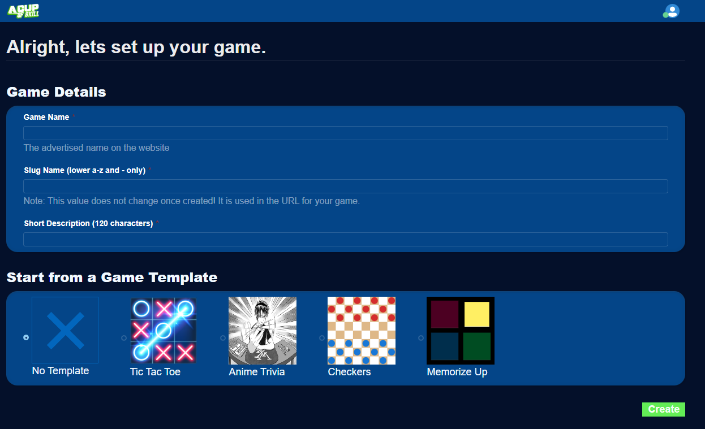
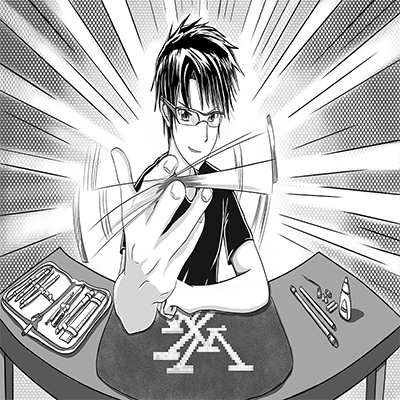
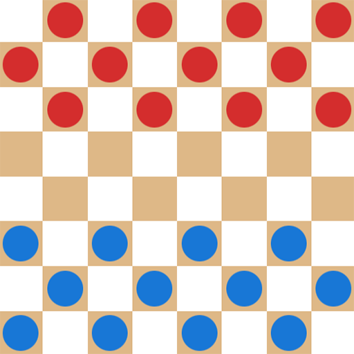
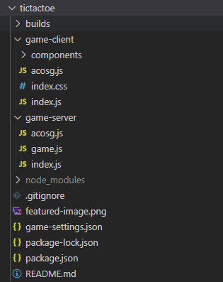

Create your own browser game using JavaScript frontend and backend with automatic multiplayer driven by JSON.

The platform supports realtime online turn-based games.  

Focus on gameplay, let the platform handle everything else for free.


## Become an ACOS Developer

In order to create games, you must be in our [acosgames](https://github.com/acosgames) Github organization.  Joining is free, simply follow the steps below.

1. Visit the [Developer Zone](https://acos.games/dev)
2. Follow the steps to sign in with Github and join our [acosgames](https://github.com/acosgames) organization 

## Creating a new game

1. Create a new game inside the [Developer Zone](https://acos.games/dev).
2. You may start from an existing game template or a blank template.  I recommend starting from existing template.


<!-- 2. A public GitHub repository will be created at:
```
 https://github.com/acosgames/game_slug
```
You will be added as an admin to the github repository.

!!! note "Git Clone our examples to test existing games"

    Check out the Game Templates below to explore and run our game examples without signing up!
 -->


---

## Start from an existing Game Template

When creating a game in [Developer Zone](https://acos.games/dev), you can choose from the available game templates

| Game Templates  |                                                           |                                                |                                                       |
| --------------- | --------------------------------------------------------- | ---------------------------------------------- | ----------------------------------------------------- |
| **Tic Tac Toe** <br />`git clone git@github.com:acosgames/tictactoe.git`<br />Built with React |  | [Play on ACOS](https://acos.games/g/tictactoe) | [Github Repo](https://github.com/acosgames/tictactoe) |
| **Anime Trivia** <br />`git clone git@github.com:acosgames/anime-trivia-simple.git`<br />Built with React |  | [Play on ACOS](https://acos.games/g/anime-trivia-simple) | [Github Repo](https://github.com/acosgames/anime-trivia-simple) |
| **Checkers** <br />`git clone git@github.com:acosgames/checkers.git`<br />Built with React |  | [Play on ACOS](https://acos.games/g/checkers) | [Github Repo](https://github.com/acosgames/checkers) |
| **Memorize Up** <br />`git clone git@github.com:acosgames/memorize-up.git`<br />Built with React |  | [Play on ACOS](https://acos.games/g/memorize-up) | [Github Repo](https://github.com/acosgames/memorize-up) |


### After creating your game

A new repository matching the `game_slug` you provided will be created in [acosgames](https://github.com/acosgames) organization with the game template code.  You are granted admin access to this repository.

Navigate into the game management page and find your git clone command to copy.  

```bash
git clone git@github.com:acosgames/game_slug.git
```

You will see directory structure like below once you clone to your system. 



`builds` folder has the development and production builds for both client and server, including the webpack configs.

`game-client` has the frontend code in React for our game examples.

`game-server` has the backend code using JavaScript that taps into our `globals` functions.

`game-settings.json` will configure the screen size, min/max players and team configurations.

---

## Running the game using simulator

### NodeJS 16+ or 18+

NodeJS 16+ will work, but we recommend NodeJS 18+

### **Install**

After cloning, navigate to the folder in a terminal and make sure to install the packages

```bash
npm install
```

### **Run**

To start the simulator with your client and server code:

```bash
npm start
```

This will run the following apps:

1. acosgames Simulator
2. `game-client` (ReactJS) with webpack watcher
    - Browser-Sync to restart iframe for game-client on code changes
3. `game-server` (NodeJS) with webpack watcher


### **Debug with VSCode Debug, add to launch.json**
```json
{
    "command": "npm start",
    "name": "Launch Tic Tac Toe",
    "request": "launch",
    "type": "node-terminal"
},
```

This is the preferred method for running your code, as it will allow you to properly close the concurrent processes created for simulator, client, and server. 


## Deploy Game

Deployment at this time is done from the command-line only.  You will need your deploy command which is provided in the [Developer Zone](https://acos.games/dev) inside your game management page.  

Example command:

```bash
npm run deploy -- tictactoe.FBC4864251084B188F1A6E63F70C38D3
```

Each of our game examples will build your code into *.js bundles, and upload them to acos.games.  Each deployment is automatically versioned by an incrementing number which can be used to publish specific version.  

The following files may be uploaded:

1. `./builds/server/server.bundle.js`
2. `./builds/client/client.bundle.js`
3. `./builds/client/assets/*`  - all asset files in this folder, excluding sub-folders
4. `./game-server/database.json` - optional json database that is immutable 
5. `./game-settings.json` - game settings configured from the simulator UI

## Publish Game

When you think the game is ready for production, go to the [Developer Zone](https://acos.games/dev) and click **Push to Production** for that game.  You can easily change which version is deployed from the game management page.
